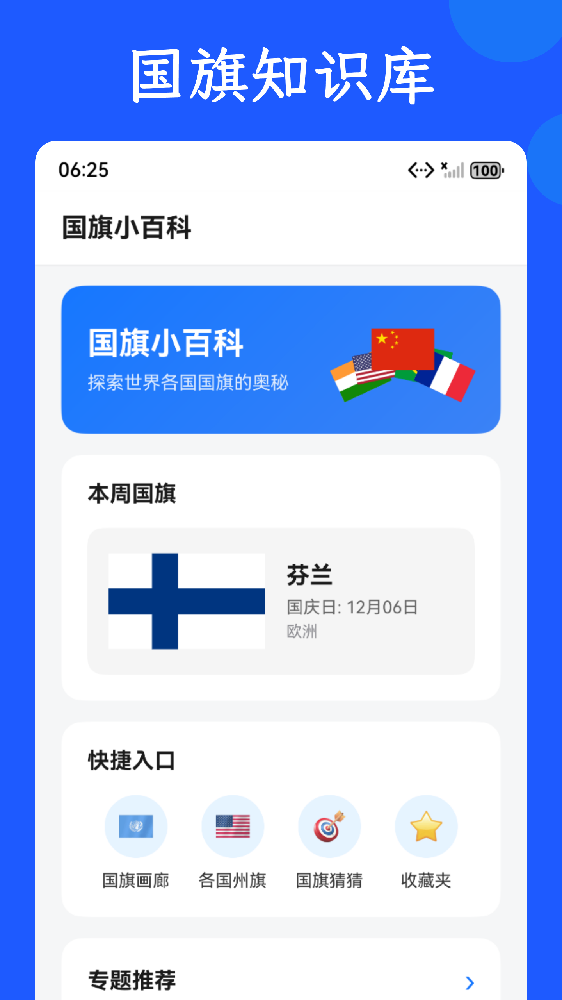
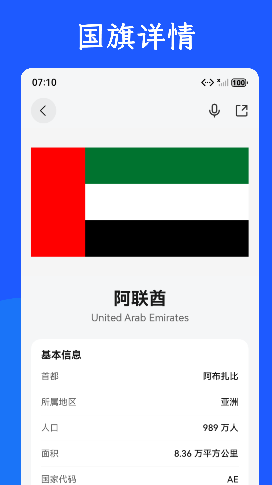
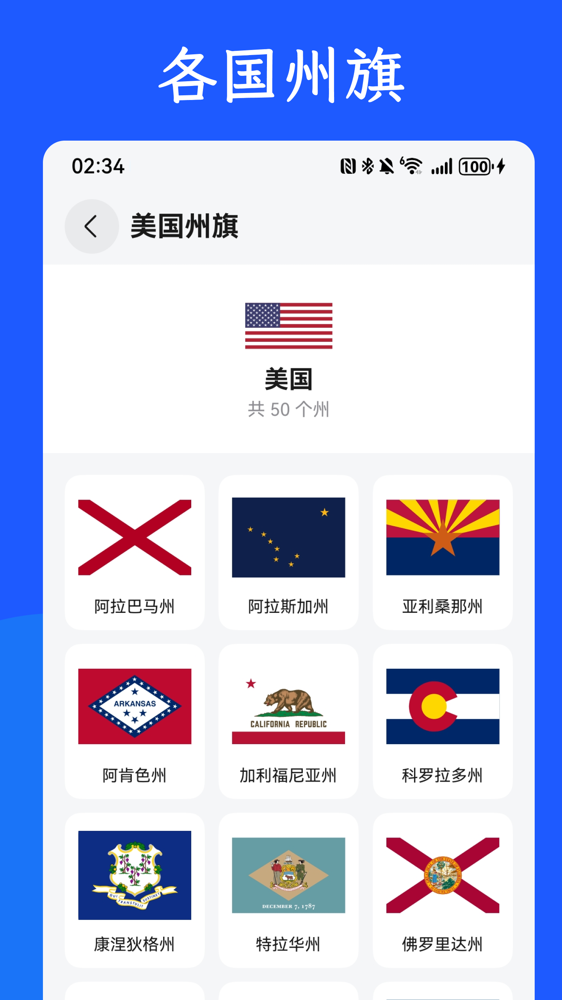
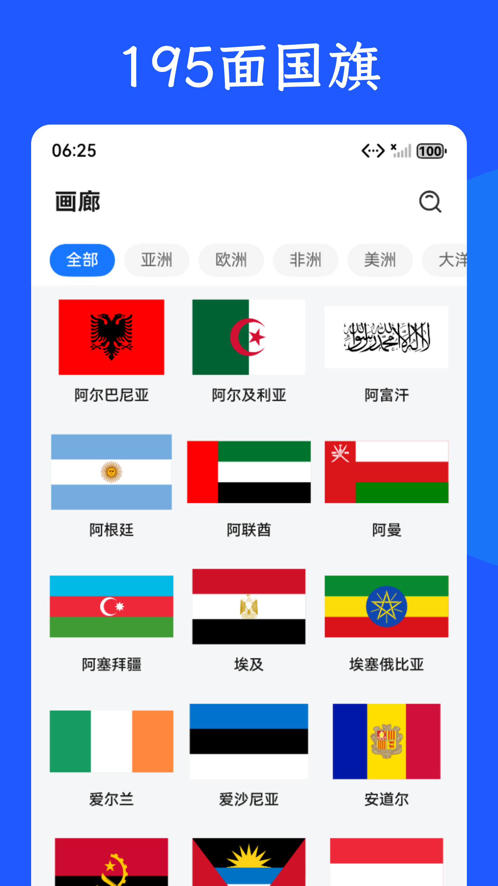
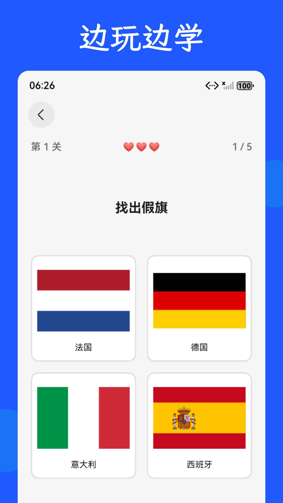

# 国旗小百科

> 一款专为国旗爱好者和学习者打造的综合性国旗知识应用

## 📱 应用信息

- **应用名称**：国旗小百科
- **包名**：com.douhua.flag
- **版本号**：1.1.0
- **开发平台**：HarmonyOS
- **开发语言**：ArkTS
- **最低支持版本**：HarmonyOS 5.0.5(17) 及以上

## ✨ 项目简介

国旗小百科是一款专为国旗爱好者和学习者打造的综合性国旗知识应用。应用涵盖全球 195 个国家和地区的国旗，以及主要国际组织和州旗信息，提供丰富的互动挑战和学习功能，让学习国旗知识变得有趣而高效。

### 主要特色

- 🌍 **内容全面**：涵盖全球 200+ 国家和地区的国旗，以及主要国际组织和州旗信息
- 📚 **信息详细**：每个国旗都包含国家名称、首都、人口、面积、国旗设计说明等详细信息
- 🎮 **挑战丰富**：6 种不同类型的互动挑战，让学习变得有趣
- 🏷️ **专题分类**：按主题组织国旗，方便系统学习和查找
- 🎨 **界面精美**：简洁清晰的界面设计，流畅的操作体验
- 🔊 **功能实用**：收藏、朗读、分享等功能，满足不同使用场景

## 📸 应用截图

### 首页

*应用首页展示国旗小百科、本周国旗、快捷入口和专题推荐*

### 国旗画廊

*浏览全球 195 个国家和地区的国旗，支持按大洲筛选和搜索*

### 州旗专区

*查看美国、加拿大、澳大利亚等国家的州旗、省旗信息*

### 国旗详情

*查看国旗详细信息，包括国家基本信息、国徽等*

### 互动游戏

*多种互动挑战游戏，寓教于乐*

## 🎯 主要功能

### 1. 国旗画廊

浏览全球 195 个国家和地区的国旗，支持按大洲筛选、搜索功能，查看国旗详细信息包括：
- 国家名称（中英文）
- 国旗大图展示
- 首都、地区、人口、面积
- 国旗设计说明
- 国徽展示

### 2. 国际组织旗帜

展示主要国际组织旗帜，包括：
- 联合国（UN）
- 欧盟（EU）
- 北约（NATO）
- 东盟（ASEAN）
- 非盟（AU）
- 阿盟（AL）
- 红十字会（ICRC）
- 奥林匹克（IOC）
- 旗帜学协会国际联盟（FIAV）

每个组织包含成立背景、总部、网站、简介等详细信息。

### 3. 州旗专区

查看美国、加拿大、澳大利亚、巴西、韩国等国家的州旗、省旗、行政区旗，了解各州首府、地区分布等详细信息。

### 4. 专题分类

按主题浏览国旗，包括：
- **知识性专题**：
  - 旗帜学：旗帜学基础知识和研究方法
  - 国旗礼仪：国旗使用规范和礼仪知识
  - 国旗制作：国旗制作的完整知识体系
  - 五星红旗历史：五星红旗的详细历史
- **国旗分类专题**：
  - 北欧旗帜、三色旗、泛阿拉伯旗帜、泛非洲旗帜
  - 国旗上的动物、太阳旗、星月旗
  - 相似旗、蓝船旗、泛斯拉夫旗、泛中美洲联邦色旗、泛米兰达色旗
  - 国际组织专题

### 5. 互动挑战

提供多种互动挑战帮助记忆和学习国旗知识:

- **国旗猜猜**：看旗猜国名、看名猜国旗两种模式，多种难度等级
- **假旗找茬**：在四面国旗中找出假旗，锻炼观察力和记忆力
- **拼写挑战**：看国旗输入国家名称，提升拼写能力
- **知识问答**：趣味国旗百科问答，学习国旗背后的知识
- **记忆翻牌**：翻牌配对挑战，锻炼记忆力和反应速度
- **涂鸦挑战**：国旗填色挑战，寓教于乐
- **HeadsUp**：全屏显示，随机展示国旗，快速识别挑战

### 6. 其他功能

- **收藏功能**：收藏喜欢的国旗，方便随时查看
- **朗读功能**：使用 HarmonyOS 语音服务朗读国旗信息
- **分享功能**：分享国旗信息到其他应用
- **振动反馈**：游戏中的触觉反馈（可开关）
- **音效播放**：游戏中的音效反馈
- **主题切换**：支持浅色/深色/跟随系统主题

## 📁 项目结构

```
flagwiki/
├── AppScope/                          # 应用级配置
│   ├── app.json5                      # 应用配置
│   └── resources/                     # 应用级资源
│       ├── base/                     # 基础资源
│       └── en_US/                    # 英文资源
├── entry/                             # 主模块
│   └── src/main/
│       ├── ets/                      # ArkTS 源代码
│       │   ├── components/            # 公共组件
│       │   │   └── SaveFlagDialog.ets # 保存国旗对话框
│       │   ├── data/                 # 数据文件
│       │   ├── entryability/         # 应用入口
│       │   │   └── EntryAbility.ets
│       │   ├── entrybackupability/   # 备份能力
│       │   │   └── EntryBackupAbility.ets
│       │   ├── pages/                # 页面
│       │   │   ├── connections/      # 连线游戏
│       │   │   ├── explore/          # 探索页面
│       │   │   ├── fakeflag/         # 假旗找茬游戏
│       │   │   ├── gallery/          # 画廊页面
│       │   │   ├── home/             # 首页
│       │   │   ├── inputgame/        # 拼写挑战
│       │   │   ├── memory/           # 记忆翻牌游戏
│       │   │   ├── paintgame/        # 涂鸦游戏
│       │   │   ├── profile/          # 个人中心
│       │   │   ├── quiz/             # 国旗猜猜游戏
│       │   │   ├── stateflag/        # 州旗页面
│       │   │   ├── topic/            # 专题页面
│       │   │   └── trivia/           # 知识问答游戏
│       │   ├── services/             # 服务
│       │   └── utils/                # 工具类
│       │       ├── coatOfArmsUtil.ets # 国徽工具
│       │       ├── countryData.ets   # 国家数据
│       │       ├── favoritesManager.ets # 收藏管理
│       │       ├── GameProgressManager.ets # 游戏进度管理
│       │       ├── PreferencesManager.ets # 偏好设置管理
│       │       ├── ScreenshotManager.ets # 截图管理
│       │       ├── SoundEffectUtil.ets # 音效工具
│       │       ├── StateFlagData.ets # 州旗数据
│       │       ├── TextReaderUtil.ets # 文本朗读工具
│       │       ├── VibratorUtil.ets  # 振动工具
│       │       └── WeeklyFlagData.ets # 本周国旗数据
│       ├── resources/                # 资源文件
│       │   ├── base/                # 基础资源
│       │   │   ├── element/         # 元素资源
│       │   │   ├── media/           # 媒体资源
│       │   │   └── profile/         # 配置文件
│       │   └── rawfile/             # 原始文件
│       │       ├── coat_of_arms/    # 国徽图片
│       │       ├── flags/           # 国旗 SVG
│       │       ├── sfx/             # 音效文件
│       │       └── state_flags/     # 州旗图片
│       └── module.json5             # 模块配置
├── scripts/                          # 脚本工具
│   ├── download_coats_of_arms.js    # 下载国徽脚本
│   └── ...                          # 其他工具脚本
├── docs/                             # 文档
├── CHANGELOG.md                      # 变更日志
├── README.md                         # 项目说明（本文件）
└── oh-package.json5                  # 依赖配置
```

### 核心目录说明

- **pages/**：所有页面组件，按功能模块组织
- **utils/**：工具类，包括数据管理、系统服务封装等
- **components/**：可复用的 UI 组件
- **data/**：数据文件（如需要）
- **resources/rawfile/**：原始资源文件（音频、图片等）

## 🚀 如何作为模板使用

### 1. 克隆项目

```bash
git clone <repository-url>
cd flagwiki
```

### 2. 修改应用信息

#### 修改应用名称和包名

编辑 `AppScope/app.json5`：

```json5
{
  "app": {
    "bundleName": "com.yourcompany.yourapp",  // 修改为你的包名
    "vendor": "Your Company",                  // 修改为你的公司名
    "versionCode": 1,
    "versionName": "1.0.0",
    "icon": "$media:layered_image",
    "label": "$string:app_name"               // 修改字符串资源中的 app_name
  }
}
```

#### 修改应用图标

替换以下文件：
- `AppScope/resources/base/media/layered_image.png`：应用图标
- `entry/src/main/resources/base/media/startIcon.png`：启动图标

### 3. 修改主题颜色

编辑 `entry/src/main/resources/base/element/color.json`，修改颜色资源：

```json
{
  "color": [
    {
      "name": "button_primary",
      "value": "#1677FF"  // 修改主色调
    }
  ]
}
```

### 4. 清理不需要的功能

根据你的需求，可以删除或注释掉不需要的页面和功能：

- 删除 `pages/` 下不需要的页面目录
- 更新 `resources/base/profile/main_pages.json`，移除不需要的路由
- 删除 `utils/` 下不需要的工具类

### 5. 添加新功能模块

1. 在 `pages/` 下创建新的页面目录
2. 在 `main_pages.json` 中添加路由配置
3. 在导航栏或入口处添加跳转逻辑

### 6. 构建和运行

#### 环境要求

- DevEco Studio 5.0.5 Release 及以上
- HarmonyOS SDK 5.0.5 Release 及以上
- 设备类型：华为手机
- 系统版本：HarmonyOS 5.0.5(17) 及以上

#### 构建步骤

1. 使用 DevEco Studio 打开项目
2. 等待依赖下载完成
3. 连接设备或启动模拟器
4. 点击运行按钮构建并安装应用

## 🎨 应用图标说明

应用图标文件位置：
- **应用图标**：`AppScope/resources/base/media/layered_image.png`
- **启动图标**：`entry/src/main/resources/base/media/startIcon.png`

替换 these files即可更新应用图标。

## 🔗 AppGallery 链接

- **Web 链接**：https://appgallery.huawei.com/app/detail?id=com.douhua.flag
- **应用内打开**：`appmarket://details?id=com.douhua.flag&callType=WEB&methodType=4`
- **搜索**：在 AppGallery 中搜索"国旗小百科"

## 🛠️ 技术栈

### 核心框架

- **ArkUI**：HarmonyOS 声明式 UI 框架
- **ArkTS**：基于 TypeScript 的应用开发语言
- **Ability**：HarmonyOS 应用能力框架
- **Router**：页面路由管理

### 主要依赖

- `@ohos/hypium`：单元测试框架
- `@ohos/hamock`：Mock 测试框架

### 开发工具

- DevEco Studio：HarmonyOS 应用开发 IDE
- Hvigor：HarmonyOS 构建工具

## 🔌 华为能力与特性

### 核心框架能力

- **ArkUI**：声明式 UI 开发框架
  - 使用 `@Component`、`@Entry` 装饰器
  - 状态管理：`@State`、`@Prop`、`@Link`、`@Provide`、`@Consume`
  - 生命周期：`aboutToAppear`、`aboutToDisappear`、`onPageShow`、`onPageHide`
- **Ability**：应用能力框架
  - `UIAbility`：UI 能力，应用主入口
  - `ExtensionAbility`：扩展能力（备份能力）
- **Router**：页面路由
  - `router.pushUrl()`：跳转到新页面
  - `router.back()`：返回上一页
  - `router.replaceUrl()`：替换当前页面

### 数据与存储能力

- **Preferences**：轻量级数据存储
  - 使用 `@kit.ArkData` 中的 `preferences` API
  - 存储用户设置、游戏进度等
  - 封装在 `PreferencesManager` 工具类中
- **AppStorage**：应用级状态管理
  - 全局状态共享
  - 存储应用上下文、主题设置等

### 系统服务能力

- **振动服务（Vibrator）**
  - 使用 `@ohos.vibrator` API
  - 提供游戏中的触觉反馈
  - 支持点击、正确、错误、胜利等振动模式
  - 封装在 `VibratorUtil` 工具类中
- **语音服务（TextReader）**
  - 使用 `@kit.SpeechKit` 中的 `TextReader` API
  - 支持文本朗读功能
  - 封装在 `TextReaderUtil` 工具类中
- **分享服务（Share）**
  - 使用 `@kit.ShareKit` 中的 `systemShare` API
  - 支持系统分享功能
  - 分享国旗信息到其他应用
- **剪贴板服务（Pasteboard）**
  - 使用 `@kit.PasteboardKit` API（如需要）
  - 复制文本到剪贴板
- **提示服务（PromptAction）**
  - 使用 `@ohos.promptAction` API
  - 显示 Toast、Dialog 等提示

### 媒体与文件能力

- **音效播放**
  - 音效播放使用 `SoundPool` API
  - 封装在 `SoundEffectUtil` 工具类中
- **图片处理（Image）**
  - 使用 `@kit.ImageKit` 中的 `image` API
  - 图片解码、编码、保存
  - 封装在 `ScreenshotManager` 工具类中
- **文件系统（File）**
  - 使用 `@ohos.file.fs` API
  - 文件读写操作
  - 使用 `@kit.CoreFileKit` 中的 `fileUri` API
  - 文件 URI 处理

### 系统能力

- **配置管理（Configuration）**
  - 使用 `@kit.AbilityKit` 中的 `ConfigurationConstant`
  - 主题模式管理（浅色/深色/跟随系统）
- **国际化（i18n）**
  - 使用 `@kit.LocalizationKit` 中的 `i18n` API
  - 多语言支持
- **日志（HiLog）**
  - 使用 `@kit.PerformanceAnalysisKit` 中的 `hilog` API
  - 应用日志记录

### 扩展能力

- **备份能力（Backup）**
  - 使用 `ExtensionAbility` 实现
  - 支持应用数据备份和恢复

### 权限

应用使用的权限：

- **ohos.permission.VIBRATE**：振动权限
  - 用途：提供游戏中的触觉反馈
  - 使用场景：游戏交互时
  
- **ohos.permission.INTERNET**：网络权限
  - 用途：下载语音模型和使用在线语音服务
  - 使用场景：朗读功能选择官方声音时

## 📝 开发规范

### 代码规范

- 使用 ArkTS 语言规范
- 遵循 HarmonyOS 应用开发规范
- 使用 ESLint 进行代码检查（如配置）

### 文件命名规范

- 页面文件：使用 PascalCase，如 `FlagDetailPage.ets`
- 工具类文件：使用 camelCase，如 `VibratorUtil.ets`
- 数据文件：使用 camelCase，如 `countryData.ets`
- 组件文件：使用 PascalCase，如 `SaveFlagDialog.ets`

### 目录结构规范

- 页面按功能模块组织在 `pages/` 目录下
- 工具类统一放在 `utils/` 目录下
- 公共组件放在 `components/` 目录下
- 资源文件按类型组织在 `resources/` 目录下

### ArkUI 开发规范

- **不在 build() 中写逻辑**：所有非 UI 逻辑放在单独的函数或 ViewModel 中
- **条件渲染**：build() 中只使用简单的 if/else 进行条件 UI 渲染
- **类型安全**：不使用 `any` 或 `unknown` 类型
- **保持现有逻辑和 UI**：修改时尽量保持现有逻辑和 UI 风格

## 📄 许可证

本项目采用 [MIT License](LICENSE) 许可证。

## 🤝 贡献指南

欢迎贡献代码！请遵循以下步骤：

### 提交 Issue

如果发现 Bug 或有功能建议，请在 GitHub/Gitee Issues 中提交：

1. 检查是否已有相关 Issue
2. 创建新 Issue，描述问题或建议
3. 提供复现步骤（如适用）

### 提交 Pull Request

1. Fork 本仓库
2. 创建特性分支（`git checkout -b feature/AmazingFeature`）
3. 提交更改（`git commit -m 'Add some AmazingFeature'`）
4. 推送到分支（`git push origin feature/AmazingFeature`）
5. 开启 Pull Request

### 代码提交规范

- 使用清晰的提交信息
- 一个提交只做一件事
- 确保代码可以正常编译运行

## 📞 联系方式

- **Issues**：[GitHub Issues](https://github.com/yourusername/flagwiki/issues) 或 [Gitee Issues](https://gitee.com/yourusername/flagwiki/issues)
- **讨论**：欢迎在 Issues 中讨论

## 🙏 致谢

感谢所有为本项目做出贡献的开发者！

---

**注意**：本项目仅供学习和参考使用。国旗数据来源于公开资料，如有错误欢迎指正。